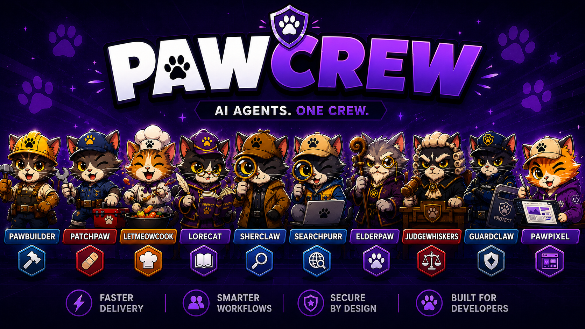
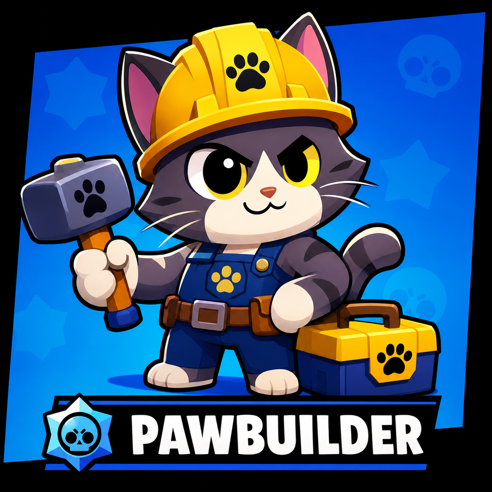
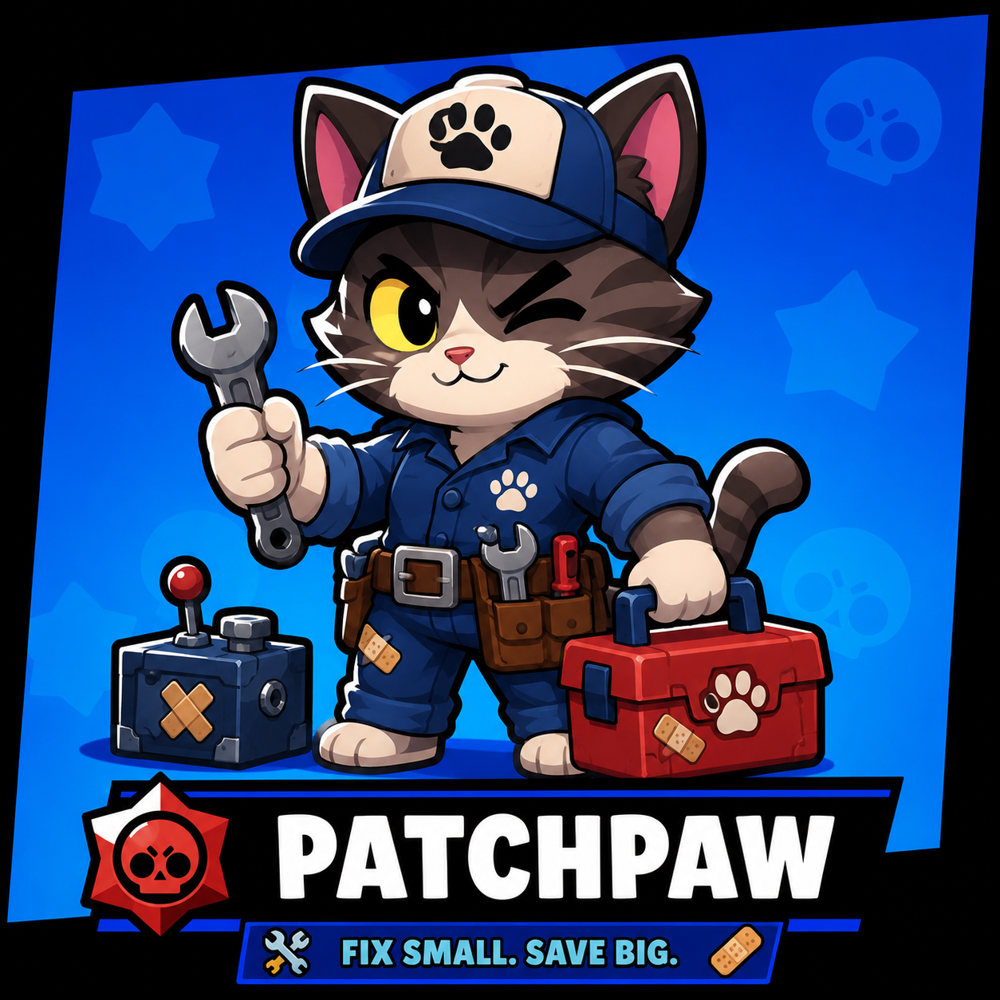
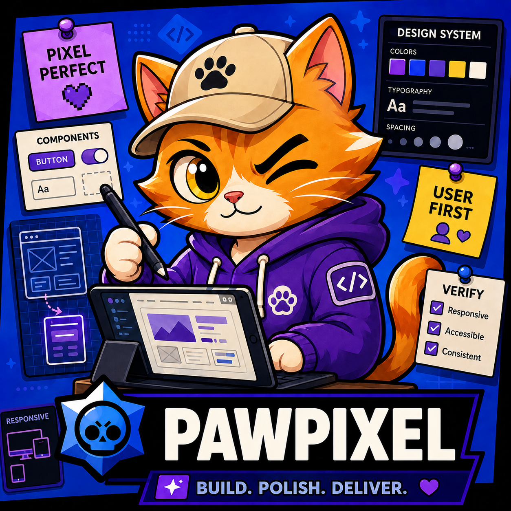
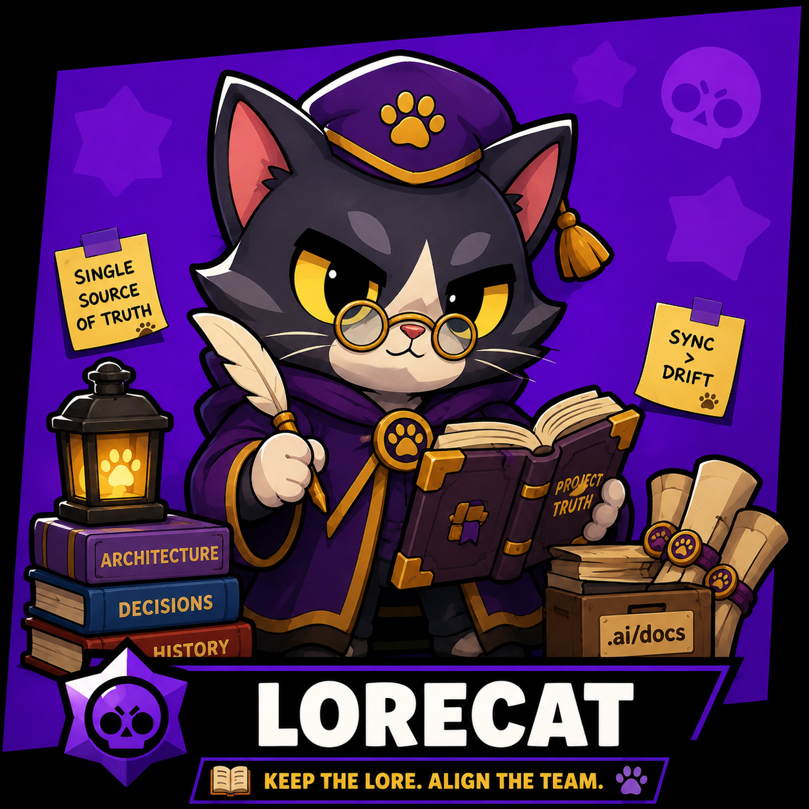
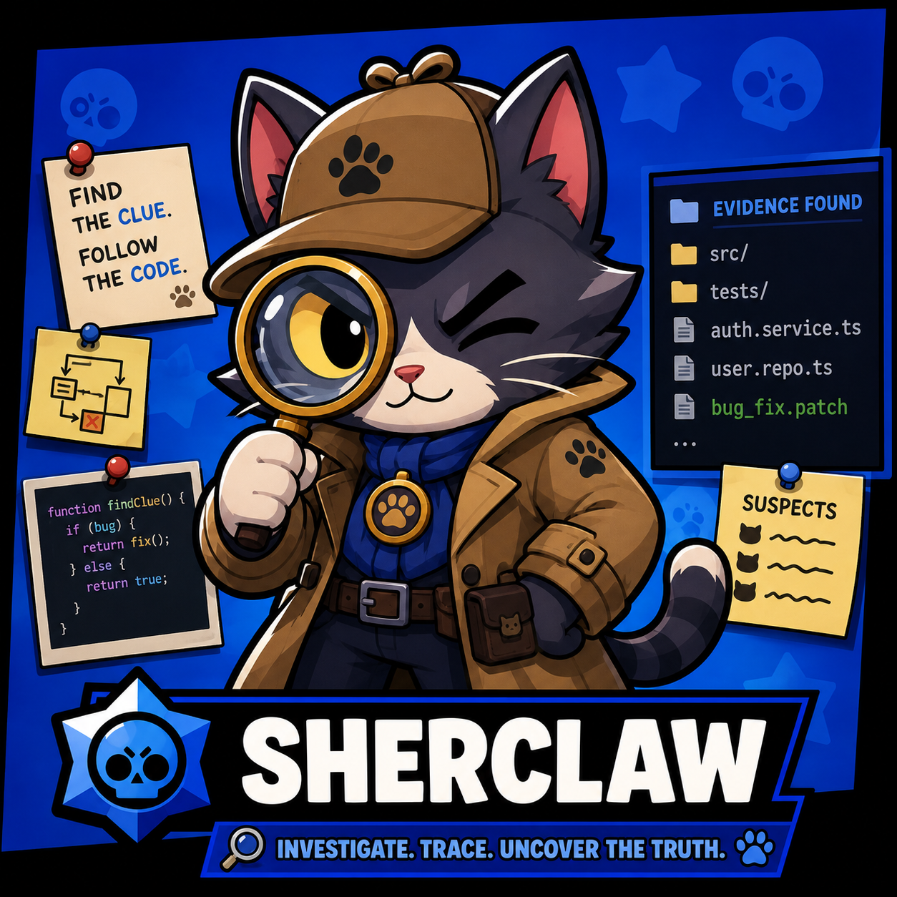
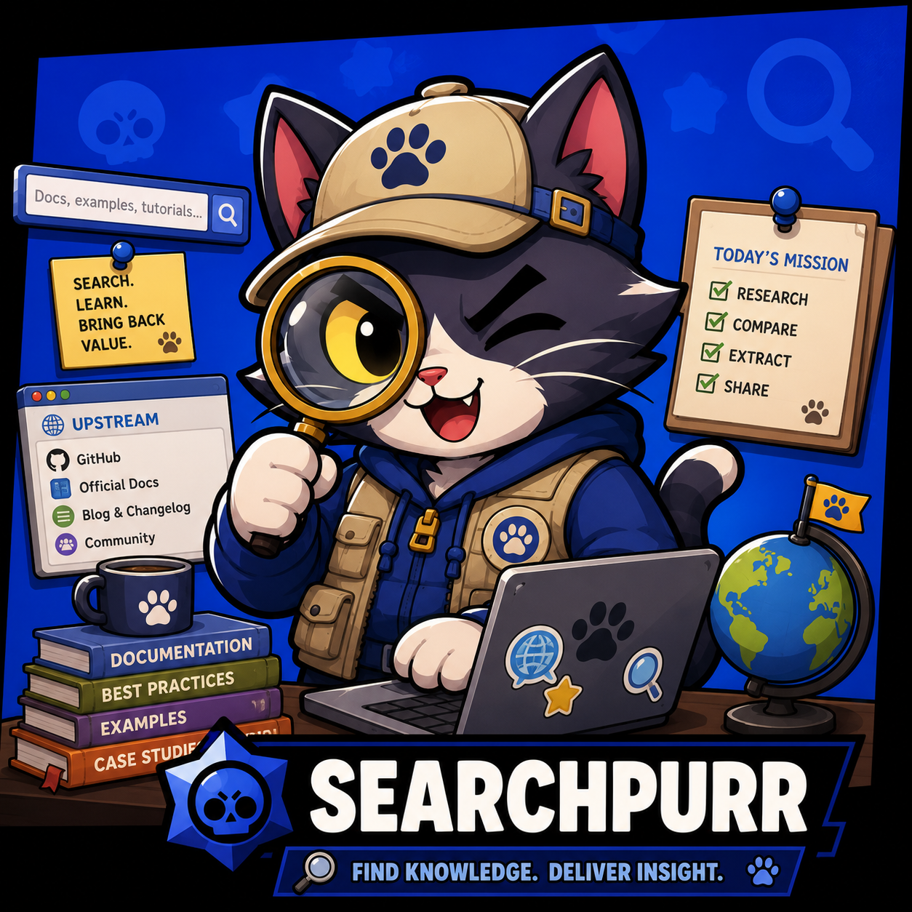
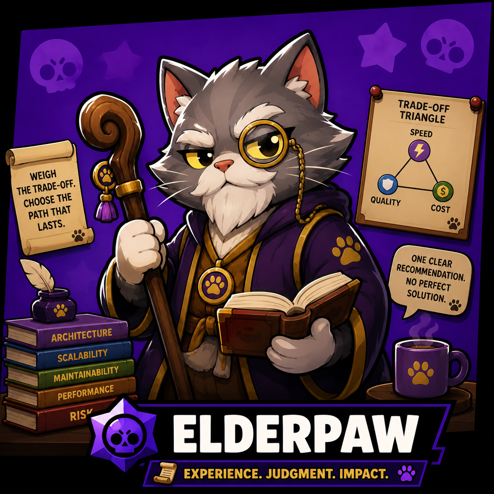
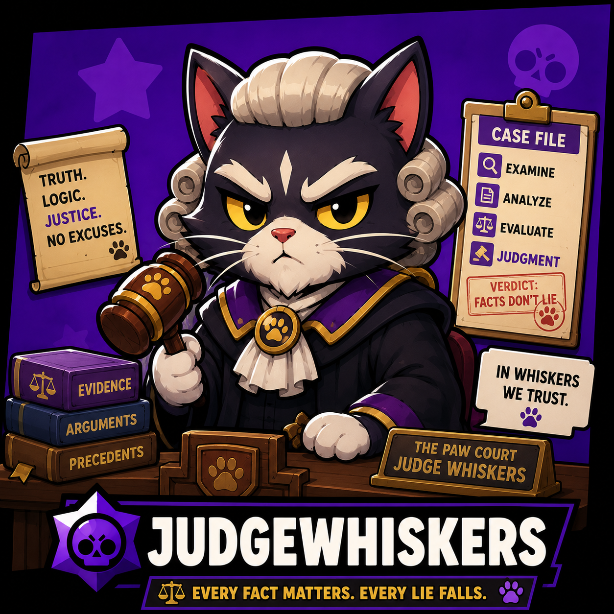
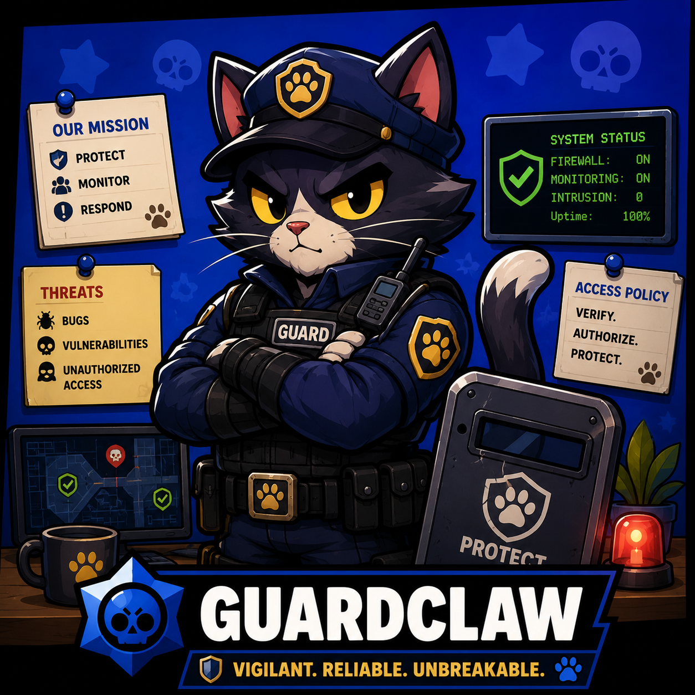

<div align="center">

# OpenCode PawCrew

**Enterprise-grade agent crew for [OpenCode](https://opencode.ai)**

Controlled autonomy for software engineering teams. Clear ownership. Audit-ready decisions. Knowledge that survives the session.



[](LICENSE)
[](https://opencode.ai)
[](https://github.com/obra/superpowers)
[](#status)

*Prompt lineage from [oh-my-openagent](https://github.com/code-yeongyu/oh-my-openagent), adapted for native OpenCode without the orchestration overhead.*

</div>

---


## Table of contents

- [Story](#story)
- [Why PawCrew](#why-pawcrew)
- [Status](#status)
- [The Crew](#the-crew)
- [Quick start](#quick-start)
- [Tooling layer](#tooling-layer)
- [Skills](#skills)
- [PDCA loop](#pdca-loop)
- [Design principles](#design-principles)
- [Flows in action](#flows-in-action)
- [Credits](#credits)
- [License](#license)

## Story

Most AI coding assistants today are either too cautious — asking for permission on every line — or too reckless — editing production code, skipping tests, and leaving the codebase inconsistent with its own documentation.

PawCrew was built for teams that need a third way: **agents that act with bounded autonomy**, where every important decision is visible, every change is verified, and every session leaves the project knowledge corpus stronger.

It started as a set of custom OpenCode agents for maintainers who were tired of:
- Models that confuse "investigate" with "implement".
- Reviews that never happen because the wrong subagent got dispatched.
- Plans that look good but are never compared against what actually shipped.
- Docs that drift from code the moment the chat ends.

PawCrew treats these as design problems, not prompt-engineering hacks. The result is a small crew of agents with explicit authority boundaries, deterministic plugins for knowledge governance, and a PDCA loop that makes work auditable by default.

For frontend work, PawPixel adds a closed token layer: `DESIGN.md` is the design-system contract, `frontend-guardian.ts` checks edits for violations, and a family of polish/audit/critique/delight skills refine the output.

## Why PawCrew

- **Role clarity over role explosion** — four primary agents, five specialists, each with one job, one approval policy, and one completion contract. No agent-of-agents. No hidden runtime.
- **Native OpenCode** — agents, commands, skills, and permissions live in standard OpenCode config. No scheduler, no router, no custom orchestration layer to maintain.
- **Approval at the right gates** — PawBuilder stops at material design decisions, PatchPaw stops before the diff, LetMeowCook runs autonomously and reports at the end.
- **OpenWiki-backed knowledge governance** — LoreCat owns `.ai/docs` as the project truth corpus. Generation, update, and validation delegate to OpenWiki when installed; drift detection, source-of-truth reconciliation, and sanctioned write paths remain deterministic PawCrew behavior.
- **Verification-first completion** — no task is "done" without fresh evidence: tests, type checks, builds, and a Check Record against observable success criteria.
- **Continuous improvement loop** — the `pdca-loop` and `retrospective` skills convert every completed task into feedback for the kit itself.

## Status

**Beta · production-ready for experienced teams.**

PawCrew is actively used for real software engineering work on macOS and Linux with [OpenCode](https://opencode.ai) and the [Superpowers](https://github.com/obra/superpowers) plugin. The agent architecture, knowledge model, and PDCA workflow are stable. Prompt-level refinements and new skills land frequently, so pin a commit if you need reproducible behavior.

- Windows support is untested.
- Breaking changes between releases are expected while the kit stabilizes.
- Issues and PRs are welcome — see **Contributing** below.

This is a CLI/agent kit, not a visual app. The end-to-end walkthroughs in **Flows in action** below are the demo.

## The Crew

A small crew with explicit authority boundaries. No agent-of-agents, no hidden runtime.

### Primary agents

<table width="100%">
  <tr>
    <td width="30%" align="center" valign="top">
      
      <br><sub><i>The user owns the destination. I own the path there.</i></sub>
    </td>
    <td width="70%" valign="top">
      PawBuilder takes a feature request from idea to verified implementation while keeping material design decisions visible to the user. It explores the existing system, proposes an approved design, then builds and verifies with Superpowers process skills. It never asks about implementation trivia, but it always stops at architecture, public API, schema, persistence, and behavior changes.
    </td>
  </tr>
  <tr><td colspan="2"><b>Role:</b> <code>Collaborative Feature Engineer</code></td></tr>
  <tr><td colspan="2"><b>Tagline:</b> "Build this with me."</td></tr>
  <tr><td colspan="2"><b>Prompt:</b> <a href=".opencode/agent/pawbuilder.md"><code>pawbuilder.md</code></a></td></tr>
  <tr><td colspan="2"><b>Default Model:</b> <code>ollama-cloud/glm-5.2</code></td></tr>
  <tr><td colspan="2"><b>Recommended Models:</b> `ollama-cloud/glm-5.2` `9router/cx/gpt-5.5` `cliproxy/gpt-5.6-sol`</td></tr>
  <tr><td colspan="2"><b>Model Guidance:</b> Choose a model with strong planning, delegation, and user-facing decision discipline. PawBuilder coordinates Superpowers process skills and multi-subagent research, so instruction-following and context budget matter more than raw coding throughput.</td></tr>
</table>

<table width="100%">
  <tr>
    <td width="30%" align="center" valign="top">
      
      <br><sub><i>Understand before changing. Verify before closing.</i></sub>
    </td>
    <td width="70%" valign="top">
      PatchPaw is the change-controlled maintenance engineer. It classifies every request as BUG or CHANGE REQUEST, investigates the repository first, proposes the smallest correct change, and gets explicit approval before editing. It fixes the thing without renovating the neighborhood, then verifies and syncs knowledge for approved change requests.
    </td>
  </tr>
  <tr><td colspan="2"><b>Role:</b> <code>Change-Controlled Maintenance Engineer</code></td></tr>
  <tr><td colspan="2"><b>Tagline:</b> "Fix this, don't get creative."</td></tr>
  <tr><td colspan="2"><b>Prompt:</b> <a href=".opencode/agent/patchpaw.md"><code>patchpaw.md</code></a></td></tr>
  <tr><td colspan="2"><b>Default Model:</b> <code>ollama-cloud/glm-5.2</code></td></tr>
  <tr><td colspan="2"><b>Recommended Models:</b> `ollama-cloud/glm-5.2` `9router/cx/gpt-5.4-mini` `cliproxy/gpt-5.6-sol`</td></tr>
  <tr><td colspan="2"><b>Model Guidance:</b> Prefer a model that is conservative and precise. PatchPaw must distinguish bugs from change requests, resist premature fixes, and produce minimal diffs. Strong root-cause reasoning beats creative generation here.</td></tr>
</table>

<table width="100%">
  <tr>
    <td width="30%" align="center" valign="top">
      
      <br><sub><i>100% or nothing.</i></sub>
    </td>
    <td width="70%" valign="top">
      LetMeowCook is the autonomous execution engineer. It accepts a complete goal — migrations, upgrades, CI fixes — and owns it end-to-end. It makes reasonable technical decisions, runs verification without asking, recovers from failures, and finishes with a mandatory outcome report. It asks only when blocked by missing credentials, ambiguous business decisions, or external destructive actions.
    </td>
  </tr>
  <tr><td colspan="2"><b>Role:</b> <code>Autonomous Execution Engineer</code></td></tr>
  <tr><td colspan="2"><b>Tagline:</b> "Take this goal off my hands."</td></tr>
  <tr><td colspan="2"><b>Prompt:</b> <a href=".opencode/agent/letmeowcook.md"><code>letmeowcook.md</code></a></td></tr>
  <tr><td colspan="2"><b>Default Model:</b> <code>ollama-cloud/glm-5.2</code></td></tr>
  <tr><td colspan="2"><b>Recommended Models:</b> `ollama-cloud/glm-5.2` `9router/cx/gpt-5.5` `cliproxy/gpt-5.6-sol`</td></tr>
  <tr><td colspan="2"><b>Model Guidance:</b> Pick a model with high tool autonomy and persistence. LetMeowCook does the work itself, so it needs strong coding, debugging, and recovery skills rather than delegation ceremony.</td></tr>
</table>

<table width="100%">
  <tr>
    <td width="30%" align="center" valign="top">
      
      <br><sub><i>Interfaces that look intentional.</i></sub>
    </td>
    <td width="70%" valign="top">
      PawPixel is the frontend and UI specialist. It gathers design context, selects a taste direction from the kit's taste skills, and builds production-grade accessible UI within the existing project stack. It owns components, pages, layouts, design tokens, motion, and visual QA. It does not modify backend APIs or data models.
    </td>
  </tr>
  <tr><td colspan="2"><b>Role:</b> <code>Frontend & UI Specialist</code></td></tr>
  <tr><td colspan="2"><b>Tagline:</b> "Design this with intention."</td></tr>
  <tr><td colspan="2"><b>Prompt:</b> <a href=".opencode/agent/pawpixel.md"><code>pawpixel.md</code></a></td></tr>
  <tr><td colspan="2"><b>Default Model:</b> <code>openai/gpt-5.6-luna</code></td></tr>
  <tr><td colspan="2"><b>Recommended Models:</b> `openai/gpt-5.6-luna` `cliproxy/gpt-5.6-sol` `google-vertex/gemini-3.5-flash`</td></tr>
  <tr><td colspan="2"><b>Model Guidance:</b> Choose a model with strong visual reasoning, design-system discipline, and coding accuracy. PawPixel must read context, pick a taste, and produce working UI, so instruction-following and attention to aesthetic details matter more than raw speed.</td></tr>
</table>

<table width="100%">
  <tr>
    <td width="30%" align="center" valign="top">
      
      <br><sub><i>Git recency is evidence, never authority.</i></sub>
    </td>
    <td width="70%" valign="top">
      LoreCat governs the project knowledge corpus under `.ai/docs`. It answers questions from the corpus, checks freshness against Git, verifies implementation claims through Sherclaw, detects docs-vs-code drift, and reconciles sources of truth. In direct mode it asks the user to resolve material conflicts; as a subagent it returns structured evidence only.
    </td>
  </tr>
  <tr><td colspan="2"><b>Role:</b> <code>Project Knowledge Governor</code></td></tr>
  <tr><td colspan="2"><b>Tagline:</b> "What does the project officially say — and is it still true?"</td></tr>
  <tr><td colspan="2"><b>Prompt:</b> <a href=".opencode/agent/lorecat.md"><code>lorecat.md</code></a></td></tr>
  <tr><td colspan="2"><b>Default Model:</b> <code>openai/gpt-5.6-luna</code></td></tr>
  <tr><td colspan="2"><b>Recommended Models:</b> `openai/gpt-5.6-luna` `cliproxy/gpt-5.6-sol` `ollama-cloud/glm-5.2`</td></tr>
  <tr><td colspan="2"><b>Model Guidance:</b> Use a model with strong long-context reading, structured output, and careful handling of conflicting claims. LoreCat rarely edits and must never silently pick a side in normative conflicts.</td></tr>
</table>

### Intelligence subagents

<table width="100%">
  <tr>
    <td width="30%" align="center" valign="top">
      
      <br><sub><i>Evidence only. Absolute paths always.</i></sub>
    </td>
    <td width="70%" valign="top">
      Sherclaw is the read-only internal code investigator. It answers where things live, how they currently work, who consumes them, and what tests cover them. It gives evidence, not opinions, and never edits code or spawns further agents.
    </td>
  </tr>
  <tr><td colspan="2"><b>Role:</b> <code>Code Truth</code></td></tr>
  <tr><td colspan="2"><b>Tagline:</b> "Show me where it lives and how it works."</td></tr>
  <tr><td colspan="2"><b>Prompt:</b> <a href=".opencode/agent/sherclaw.md"><code>sherclaw.md</code></a></td></tr>
  <tr><td colspan="2"><b>Default Model:</b> <code>openai/gpt-5.6-luna</code></td></tr>
  <tr><td colspan="2"><b>Recommended Models:</b> `ollama-cloud/glm-5.2` `9router/cx/gpt-5.4-mini` `cliproxy/gpt-5.6-sol`</td></tr>
  <tr><td colspan="2"><b>Model Guidance:</b> A fast, context-efficient coding model is ideal. Sherclaw reads and reports; it does not generate large prose or creative solutions.</td></tr>
</table>

<table width="100%">
  <tr>
    <td width="30%" align="center" valign="top">
      
      <br><sub><i>Labeled evidence beats confident memory.</i></sub>
    </td>
    <td width="70%" valign="top">
      SearchPurr is the external docs and source researcher. It uses Context7 for official docs, Exa for broad web research, and GitHub public code search for real-world usage. Every claim carries a source label — official docs, real-world implementation, or community discussion.
    </td>
  </tr>
  <tr><td colspan="2"><b>Role:</b> <code>External Truth</code></td></tr>
  <tr><td colspan="2"><b>Tagline:</b> "Find the source, not the guess."</td></tr>
  <tr><td colspan="2"><b>Prompt:</b> <a href=".opencode/agent/searchpurr.md"><code>searchpurr.md</code></a></td></tr>
  <tr><td colspan="2"><b>Default Model:</b> <code>openai/gpt-5.6-luna</code></td></tr>
  <tr><td colspan="2"><b>Recommended Models:</b> `ollama-cloud/glm-5.2` `9router/cx/gpt-5.5` `cliproxy/gpt-5.6-sol`</td></tr>
  <tr><td colspan="2"><b>Model Guidance:</b> Choose a model comfortable with synthesizing docs, changelogs, and code examples. SearchPurr must cite sources explicitly and avoid training-memory assumptions.</td></tr>
</table>

<table width="100%">
  <tr>
    <td width="30%" align="center" valign="top">
      
      <br><sub><i>One clear path. No unnecessary complexity.</i></sub>
    </td>
    <td width="70%" valign="top">
      ElderPaw is the read-only technical advisor. It is consulted on architecture trade-offs, hard debugging, concurrency, security, and suspiciously complex solutions. It returns exactly one primary recommendation with effort estimate, confidence, and key risks.
    </td>
  </tr>
  <tr><td colspan="2"><b>Role:</b> <code>Technical Judgement</code></td></tr>
  <tr><td colspan="2"><b>Tagline:</b> "You can do that... but here's what you'll regret later."</td></tr>
  <tr><td colspan="2"><b>Prompt:</b> <a href=".opencode/agent/elderpaw.md"><code>elderpaw.md</code></a></td></tr>
  <tr><td colspan="2"><b>Default Model:</b> <code>ollama-cloud/glm-5.2</code></td></tr>
  <tr><td colspan="2"><b>Recommended Models:</b> `ollama-cloud/glm-5.2` `cliproxy/gpt-5.6-sol` `openai/gpt-5.6-luna`</td></tr>
  <tr><td colspan="2"><b>Model Guidance:</b> Use your strongest planning-and-judgment model. ElderPaw consumes provided evidence and produces dense, actionable advice; reasoning quality matters more than tool throughput.</td></tr>
</table>

<table width="100%">
  <tr>
    <td width="30%" align="center" valign="top">
      
      <br><sub><i>Verdict first. Severity-gated findings.</i></sub>
    </td>
    <td width="70%" valign="top">
      JudgeWhiskers is the dispatched review specialist. PawBuilder and PatchPaw override Superpowers review dispatch to send review work here instead of to a generic agent or Sherclaw. It returns verdicts as BLOCKER / SHOULD-FIX / NIT with spec compliance evidence and runs verification itself when possible.
    </td>
  </tr>
  <tr><td colspan="2"><b>Role:</b> <code>Review Gate</code></td></tr>
  <tr><td colspan="2"><b>Tagline:</b> "Does this meet the spec?"</td></tr>
  <tr><td colspan="2"><b>Prompt:</b> <a href=".opencode/agent/judgewhiskers.md"><code>judgewhiskers.md</code></a></td></tr>
  <tr><td colspan="2"><b>Default Model:</b> <code>ollama-cloud/glm-5.2</code></td></tr>
  <tr><td colspan="2"><b>Recommended Models:</b> `ollama-cloud/glm-5.2` `cliproxy/gpt-5.6-sol-review` `9router/cx/gpt-5.6-sol-review`</td></tr>
  <tr><td colspan="2"><b>Model Guidance:</b> Prefer a review-tuned or reasoning-capable model. JudgeWhiskers must read diffs, compare against specs, and give severity-gated verdicts without drifting into implementation.</td></tr>
</table>

<table width="100%">
  <tr>
    <td width="30%" align="center" valign="top">
      
      <br><sub><i>Trust boundary first. Evidence-backed findings only.</i></sub>
    </td>
    <td width="70%" valign="top">
      GuardClaw is the focused read-only security reviewer. It is dispatched for explicit security reviews or when a change crosses a high-risk boundary: auth/authz, secrets, payments, untrusted input, filesystem, network, deserialization, or sensitive data. It reports only evidence-backed vulnerabilities with exploit path, confidence, remediation, and residual risk.
    </td>
  </tr>
  <tr><td colspan="2"><b>Role:</b> <code>Security Verdict</code></td></tr>
  <tr><td colspan="2"><b>Tagline:</b> "Where is the trust boundary?"</td></tr>
  <tr><td colspan="2"><b>Prompt:</b> <a href=".opencode/agent/guardclaw.md"><code>guardclaw.md</code></a></td></tr>
  <tr><td colspan="2"><b>Default Model:</b> <code>ollama-cloud/glm-5.2</code></td></tr>
  <tr><td colspan="2"><b>Recommended Models:</b> `ollama-cloud/glm-5.2` `cliproxy/gpt-5.6-sol` `openai/gpt-5.6-luna`</td></tr>
  <tr><td colspan="2"><b>Model Guidance:</b> Use a model with strong security reasoning and low hallucination on exploit paths. GuardClaw must distinguish real vulnerabilities from speculative risks.</td></tr>
</table>

## Quick start

### Global install (recommended for a single machine)

```bash
git clone https://github.com/duwscan/opencode-crewkit.git
cd opencode-crewkit
npm install          # installs OpenWiki for LoreCat knowledge generation
./install.sh
```

`install.sh` is idempotent: it symlinks agents, commands, and skills into
`~/.config/opencode/` (available in **every project**) and pre-flights your
environment. If `npm install` was skipped, LoreCat falls back to its native
knowledge tools.

### Project-local install (recommended for shared or existing projects)

If the project already has its own OpenCode agents, skills, or plugin config,
overlay PawCrew into the repo itself so the crew travels with the project and
never overwrites the team's customizations by accident:

```bash
./install.sh --project ./my-existing-project
```

Behavior:

- Agents, commands, skills, and plugins are **copied** into `my-existing-project/.opencode/`.
- Existing project files are preserved unless you pass `--force` (a backup is created).
- The resulting `.opencode/` is portable: clone the repo on another machine and the crew is already there.
- A `.crewkit-overlay.md` note is written so the team knows where the files came from.

Then **restart opencode** (config is not hot-reloaded) and pick your entry point:

| Command | Routes to | Use for |
|---|---|---|
| `/build <feature>` | PawBuilder | New features, subsystems, creative work |
| `/patch <bug or change>` | PatchPaw | Bugs, regressions, bounded behavior changes |
| `/cook <goal>` | LetMeowCook | Migrations, upgrades, "make CI pass" |
| `/design <UI request>` | PawPixel | Pages, components, redesigns, design systems, UI audits |
| `/lore-cat-save-it` | LoreCat | Persist this conversation's knowledge into `.ai/docs` (verified, normalized, linked — not chat dumps) |
| `/doctor` | (tooling) | Check PawCrew installation: symlinks, plugins, OpenWiki, AST-Grep, repo state |

With the native `build`/`plan` agents disabled, the default agent is **PawBuilder**.

### Per-project model / provider / API key for OpenWiki

PawCrew delegates OpenWiki generation/update/validation to the `openwiki` CLI. Each project can override the global `~/.openwiki/.env` settings by editing `.ai/openwiki.config.json`:

```json
{
  "provider": "openai-compatible",
  "modelId": "openai/gpt-5.6-luna",
  "baseUrl": "https://api.example.com/v1",
  "apiKey": "sk-..."
}
```

- `modelId` is passed via `--modelId` to every `openwiki` invocation.
- `provider`, `baseUrl`, and `apiKey` are injected as environment variables (`OPENWIKI_PROVIDER`, `OPENAI_COMPATIBLE_BASE_URL`, `OPENAI_COMPATIBLE_API_KEY`).
- Empty values fall back to `~/.openwiki/.env`.
- This file is ignored by default — do not commit plain API keys.

## Tooling layer

Agents get tools by responsibility — the cheapest precise tool wins.

| Capability | PawBuilder | PatchPaw | LetMeowCook | LoreCat | Sherclaw | SearchPurr | ElderPaw | Reviewer |
|---|:---:|:---:|:---:|:---:|:---:|:---:|:---:|:---:|
| Read / Glob / Grep / LSP | ✅ | ✅ | ✅ | docs+git | ✅ | 📄 | ✅ | ✅ |
| AST-Grep (`sg`) | ✅ | ✅ | ✅ | ❌ | 🔍 no-rewrite | ❌ | optional | ✅ |
| Context7 (official docs) | light | via SearchPurr | ✅ | ❌ | ❌ | ✅ | ❌ | ❌ |
| Exa (broad web) | via SearchPurr | via SearchPurr | ✅ | ❌ | ❌ | ✅ | ❌ | ❌ |
| Public/GitHub code search | via SearchPurr | via SearchPurr | ✅ | ❌ | ❌ | ✅ | ❌ | ❌ |
| Wiki tools (`.ai/docs`) | via LoreCat | via LoreCat | via LoreCat | ✅ | ❌ | ❌ | ❌ | ❌ |
| Edit | approval-gated | approval-gated | ✅ | ❌ (wiki tools only) | ❌ | ❌ | ❌ | ❌ |
| Run tests / typecheck | ✅ | ✅ | ✅ | git read-only | git/sg only | ❌ | git/sg only | ✅ |

**Search escalation policy** (shared across agents): exact text → `grep` · files →
`glob` · symbols/references → `LSP` · code shape → `AST-Grep` · official docs →
`Context7` · real-world usage → GitHub code search · broad discovery → `Exa`.

Every scoping rule is **enforced by OpenCode permission patterns**, not just
prompt suggestions — e.g. Sherclaw's `edit: deny`, `task: deny`, MCP denials, and
a hard block on `sg --update-all` (no rewrites from a read-only investigator).

## Skills

| Skill | Type | Purpose |
|---|---|---|
| [`ast-grep`](.opencode/skills/ast-grep/SKILL.md) | domain | Structural search & safe rewrite via `sg`; falls back to grep+LSP when the binary is missing — and never fakes a structural search |
| [`frontend-ui-engineering`](.opencode/skills/frontend-ui-engineering/SKILL.md) | domain | Production-grade UI engineering: component architecture, responsive, accessibility, state, anti-AI-aesthetic verification |
| [`frontend-taste-router`](.opencode/skills/frontend-taste-router/SKILL.md) | domain | Maps a frontend brief to the right taste skill: design-taste-frontend, high-end-visual-design, minimalist-ui, gpt-taste, industrial-brutalist-ui |
| [`design-md-contract`](.opencode/skills/design-md-contract/SKILL.md) | domain | Maintain DESIGN.md as the closed token layer and single source of truth for the project's UI system |
| [`frontend-audit`](.opencode/skills/frontend-audit/SKILL.md) | domain | Measurable a11y, performance, responsive, theming, and anti-pattern checks with P0-P3 severity |
| [`frontend-critique`](.opencode/skills/frontend-critique/SKILL.md) | domain | UX and design critique across hierarchy, IA, cognitive load, and brand fit |
| [`frontend-polish`](.opencode/skills/frontend-polish/SKILL.md) | domain | Final consistency and micro-detail pass before shipping UI |
| [`frontend-delight`](.opencode/skills/frontend-delight/SKILL.md) | domain | Tasteful motion and personality once fundamentals are solid |
| [`hashline-edit`](.opencode/skills/hashline-edit/SKILL.md) | domain | Surgical hash-anchored file edits (`LINE#ID`) to avoid stale-line errors and silent corruption |
| [`squad-mode`](.opencode/skills/squad-mode/SKILL.md) | orchestration | Lightweight parallel subagent dispatch (Sherclaw/SearchPurr/ElderPaw/LoreCat) for complex investigations |
| [`comment-polish`](.opencode/skills/comment-polish/SKILL.md) | domain | Audit and clean comments: remove AI slop, outdated notes, commented-out code; preserve intent and API docs |
| [`goal-persistence`](.opencode/skills/goal-persistence/SKILL.md) | orchestration | Persist active multi-step goals under `.ai/superpowers/goals/` for cross-session resume |
| [`change-impact-analysis`](.opencode/skills/change-impact-analysis/SKILL.md) | analysis | Change contract without touching code: current → requested → delta → dependencies → risks → verification plan |
| [`contract-regression-testing`](.opencode/skills/contract-regression-testing/SKILL.md) | analysis | API/schema/event/serialization/config/CLI compatibility matrix and concrete regression checks before approval |
| [`bug-flow`](.opencode/skills/bug-flow/SKILL.md) | process | Root-cause-first fix procedure with pre-approval contract and post-approval TDD |
| [`change-request-flow`](.opencode/skills/change-request-flow/SKILL.md) | process | Impact-analysis-first procedure for bounded behavior/API changes with mandatory knowledge sync |
| [`crewkit-skill-registry`](.opencode/skills/crewkit-skill-registry/SKILL.md) | tooling | Discover all available skills: project-local, global user, plugin-shipped, and kit skills |
| [`delegation-policy`](.opencode/skills/delegation-policy/SKILL.md) | policy | Canonical subagent dispatch targets, review dispatch rules, and dispatch mechanics |
| [`pdca-loop`](.opencode/skills/pdca-loop/SKILL.md) | process | Deming PDCA loop: Plan Record → Run Log → Check Record → Knowledge Sync + Retrospective |
| [`retrospective`](.opencode/skills/retrospective/SKILL.md) | process | Extract process lessons and propose kit improvements after completed tasks |
| [Superpowers](https://github.com/obra/superpowers) | process | PawBuilder & PatchPaw's engine: brainstorming → writing-plans → TDD → verification-before-completion |

LetMeowCook deliberately **denies** Superpowers *process* skills (enforced via
`permission.skill` patterns) while keeping domain skills — autonomy is the point;
ceremony is not. JudgeWhiskers is scoped the inverse way: skill access is
default-deny with exactly two allows — `requesting-code-review` and
`receiving-code-review` — since it is the dispatch target of the Superpowers
review flow.

## PDCA loop

PawCrew follows the Deming cycle for non-trivial work:

- **Plan** — `pawbuilder` and `patchpaw` persist a Plan Record before user approval;
  `letmeowcook` creates one autonomously during Understand/Decide.
- **Do** — execute with a lightweight Run Log.
- **Check** — a Check Record compares observable success criteria against fresh evidence.
- **Act** — Knowledge Sync plus an optional Retrospective Note for recurring process lessons.

Artifacts live under `.ai/superpowers/plans/`, `.ai/superpowers/runs/`,
`.ai/superpowers/checks/`, and `.ai/superpowers/improvements/`.

## Design principles

```text
Agent prompt  = identity · authority · boundaries · delegation · approval · completion contract
Skill         = reusable procedure
Command       = user entrypoint (routing only)
AGENTS.md     = repository specifics
```

- **No agent-of-agents.** Subagents never spawn subagents (`task: deny`).
- **Approval gates where they matter.** PawBuilder stops at design decisions,
  PatchPaw stops before the diff, LetMeowCook stops for nothing except true blockers.
- **Evidence before completion.** "Should pass" means unverified. LetMeowCook's
  turn cannot end without an audit-style outcome report.
- **Adding a behavior rarely adds an agent.** Behavior that is always-on lives in
  prompts; reusable procedure lives in skills; advice lives in subagents.

## Flows in action

Real-world scenarios where multiple agents collaborate. Each flow ends with verification and knowledge sync.

### Scenario 1: Build a new feature end-to-end

A product manager asks for organization-level API keys with expiration and revocation.

```text
You: /build organization-level API keys with expiration and revocation

PawBuilder:  I read this as implementation: feature request → explore → design → approve → build.

  PLAN  ├─ Plan Record: .ai/superpowers/plans/2026-08-21-api-keys.md
        │   Goal: org API keys with expiration + revocation, verified by tests
        │   Success criteria:
        │     - [ ] New `api_keys` table stores key hash, scopes, expires_at, revoked_at
        │     - [ ] Middleware accepts org keys and rejects expired/revoked keys
        │     - [ ] Admin CLI can create, list, revoke keys
        │     - [ ] Migration is reversible; existing user keys unaffected
        │   Flow: multi-step + brainstorming + planning

  DO    ├─ sherclaw     "existing auth model, key storage patterns, similar features"
        │               → /src/auth/user-keys.ts exists; org keys do not
        ├─ elderpaw       "single table vs reuse sessions schema — trade-offs?"
        │               → recommendation: separate `api_keys` table, effort Medium, confidence high
        ├─ lorecat        "any accepted spec or ADR for org-level auth?"
        │               → no spec; create ADR-014 after approval
        └─ Superpowers  brainstorming → design doc under .ai/superpowers/specs/

  CHECK ⏸ APPROVAL GATE — material decisions:
        1. New `api_keys` table + migration (schema change)     ← needs you
        2. Revocation = hard delete vs soft revoke flag         ← needs you

You:   separate table, soft revoke flag. Approved.

  ACT   PawBuilder:  TDD implementation → tests green → typecheck clean
        ├─ judgewhiskers dispatch → VERDICT: APPROVED_WITH_NITS (2 nits, fixed)
        ├─ LoreCat sync: ADR-014 created, architecture.md updated
        └─ Check Record: .ai/superpowers/checks/2026-08-21-api-keys.md
           → all 4 success criteria PASS

        Done. Migrations in /db/migrations/0042_api_keys.sql, tests in /tests/auth/.
```

### Scenario 2: Fix a race-condition bug

Users get logged out during concurrent API requests.

```text
You: /patch users occasionally get logged out during concurrent API requests

PatchPaw:   I read this as a bug: sherclaw → evidence → root cause → propose → approve → fix.

  PLAN  ├─ Plan Record: .ai/superpowers/plans/2026-08-21-refresh-race.md
        │   Goal: eliminate double-refresh race causing 401 logout
        │   Success criterion: concurrent refresh test passes 100/100 runs

  DO    ├─ sherclaw    session refresh flow, middleware, token rotation
        │              → 3 refresh paths found, /src/auth/refresh.ts:41 suspicious
        ├─ reproduce   concurrent curl -j 2 refreshes → one 401 reproduced ✓
        ├─ Superpowers systematic-debugging
        │              root cause: double refresh race — second request revokes the
        │              token pair the first request just wrote (no lock, check-then-act)
        └─ elderpaw    "is a per-user mutex the right fix here?"
                       → yes; avoid subsystem rewrite, confidence high

  CHECK ⏸ APPROVAL GATE — proposed minimal fix:
       add per-user mutex in refresh handler + regression test
       (NOT a session-subsystem rewrite)

You:   approved.

  ACT   PatchPaw:   regression test (red: reproduced race) → implement lock → test green
        ├─ auth suite 34/34 → typecheck ✓
        ├─ LoreCat sync: behavior unchanged; no docs update needed
        └─ Check Record: race test 100/100 PASS

        Fixed. Root cause: check-then-act race at refresh.ts:41. Touched 2 files.
        Pre-existing unrelated flake in /tests/mail noted, not touched.
```

### Scenario 3: Change request with contract impact

Rename a public API field from flat to nested, affecting external consumers.

```text
You: /patch change SessionResponse from "userId" to "user.id" (nested)

PatchPaw:   I read this as a change request: current state → delta → impact → contract → approve.

  PLAN  ├─ Plan Record: .ai/superpowers/plans/2026-08-21-session-response.md
        │   Goal: nest user.id in SessionResponse without breaking mobile client
        │   Success criteria:
        │     - [ ] Serializer returns nested shape under X-API-Version: 2
        │     - [ ] Old shape still served under X-API-Version: 1
        │     - [ ] Integration tests cover both versions
        │     - [ ] API docs updated

  DO    ├─ sherclaw               consumers of SessionResponse: serializer, 2 frontends,
        │                         6 integration tests, mobile client (external)
        ├─ skill: change-impact-analysis
        │    current_state:  { userId: string }          — serializer.ts, 11 references
        │    requested_state: { user: { id: string } }
        │    compatibility:  breaking: true  (mobile client pinned to old shape)
        │    risks: stale consumers, contract tests, API docs
        │    proposed_change: serializer → contract test → frontends → API docs → version header
        └─ skill: contract-regression-testing
             → matrix: mobile client (old), web client (new), integration tests (both)

  CHECK ⏸ APPROVAL GATE — breaking change, mobile needs a release note

You:   approved, add X-API-Version header.

  ACT   PatchPaw:   implements exactly the contract → all consumers migrated → verify → done.
        ├─ integration tests 18/18 ✓
        ├─ contract tests added for v1 + v2
        ├─ LoreCat sync: API spec updated, ADR-015 created for versioned response shape
        └─ Check Record: all success criteria PASS

        PatchPaw fixes the thing. It does not renovate the neighborhood.
```

### Scenario 4: Autonomous migration

Bump a dependency major version and make CI green.

```text
You: /cook migrate this package to the new SDK version and make CI pass

LetMeowCook:  goal understood: bump sdk v2 → v3, all checks green. Stopping condition: CI ✓

  PLAN  ├─ Plan Record: .ai/superpowers/plans/2026-08-21-sdk-v3-migration.md
        │   Goal: SDK v3, CI green
        │   Success criteria:
        │     - [ ] 47 call sites compile against v3
        │     - [ ] 61/61 tests pass
        │     - [ ] CI pipeline green
        │     - [ ] No runtime auth regression

  DO    ├─ local survey        grep + LSP: 47 call sites, 12 use removed API
        ├─ AST-Grep            sg run -p '$SDK.createClient($$$A)' — repository-wide shape migration
        ├─ Context7 (direct)   v3 migration guide: createClient → initClient, auth moved to options
        ├─ searchpurr          how 3 major OSS repos handle the auth move
        ├─ implement           47 sites migrated
        └─ recover             build fails → read error → peer dep conflict → different approach ✓

  CHECK ├─ verify              build ✓ · typecheck ✓ · 61/61 tests ✓ · CI green ✓
        └─ Check Record: all 4 criteria PASS

  ACT   ├─ Gate 1: analyze knowledge impact? → Yes
        ├─ Gate 2: update .ai/docs/references/sdk-versions.md? → Yes
        ├─ Gate 3: record process lesson? → Yes
        │   → Retrospective: "AST-Grep pattern for SDK v3 auth move saved 2 hours;
        │      add to lessons-learned.md"
        └─ Outcome Report:
           ## Goal        migrate sdk v2→v3, CI passing (unchanged after investigation)
           ## Changed     14 files, sdk ^3.1.0, config/auth wiring
           ## Decisions   kept compat shim for initClient (removed in 2 call sites only);
           ##             upstream pattern C chosen over A (smaller diff, same behavior)
           ## Verified    build, typecheck, 61/61 tests, CI run #1842 green — this turn
           ## Remaining   shim removable after Q3 deprecation; flagged in CHANGELOG
```

### Scenario 5: Drift detection and reconciliation

Check whether the current auth implementation still matches the accepted spec.

```text
You: @lorecat does the current implementation satisfy the accepted auth spec?

LoreCat:   PROJECT TRUTH query → wiki_search/wiki_read .ai/docs

  DO    ├─ spec found      .ai/docs/specs/auth-session.md — normative, accepted,
        │                  verified_commit b06768c, covers src/auth/**
        ├─ claim check     dispatch Sherclaw: "verify: sessions stored in Redis
        │                  via RedisSessionStore" → DRIFT (store = postgres)
        └─ wiki_freshness  STALE_CANDIDATES (src/auth/session.ts changed after
                           verified_commit)

  CHECK ⏸ SOURCE-OF-TRUTH RECONCILIATION (direct mode — never silently picks a side):
        Project knowledge: sessions in Redis
        Verified implementation: sessions in PostgreSQL
        [Implementation is correct — update project knowledge]
        [Specification is correct — mark IMPLEMENTATION_DRIFT]
        [Do not reconcile yet]

You:   implementation is correct.

  ACT   LoreCat:   Wiki Update Plan → wiki_save_concept (spec updated, verified_commit
           refreshed, ADR-006 superseded + ADR-014 created rather than
           rewriting decision history) → wiki_sync → wiki_validate
           → Knowledge Updated report. Git recency was freshness evidence,
           never authority — your choice was.
```

### Scenario 6: Security review on a high-risk change

A change touches authentication and payment webhooks; you want a focused security pass.

```text
You: /patch add webhook signature verification for Stripe events

PatchPaw:   I read this as a change request: auth + payment boundary → impact → contract → approve.

  DO    ├─ sherclaw     current webhook handler, secret storage, signature parsing
        ├─ searchpurr    Stripe official signature verification docs
        ├─ change-impact-analysis → payment boundary affected
        └─ guardclaw     high-risk dispatch: auth/authz + secrets + untrusted input
             → findings: webhook secret in env only ✓, constant-time compare missing ✗,
               replay attack window not bounded ✗

  CHECK ⏸ APPROVAL GATE — guardclaw findings must be addressed before merge

You:   approved, fix both findings.

  ACT   PatchPaw:   implement constant-time compare + timestamp tolerance → tests
        ├─ guardclaw re-review → no new findings, residual risk: clock skew
        ├─ judgewhiskers code review → VERDICT: APPROVED
        ├─ LoreCat sync: security ADR updated with webhook verification pattern
        └─ Check Record: signature verification passes test vectors
```

## Credits

- **[oh-my-openagent](https://github.com/code-yeongyu/oh-my-openagent)** — role
  prompts descend from its Sisyphus (GLM variant), Hephaestus, Explore, Librarian,
  and Oracle prompts. See [THIRD-PARTY-NOTICES.md](THIRD-PARTY-NOTICES.md).
- **[Superpowers](https://github.com/obra/superpowers)** — the process engine
  (brainstorming, planning, TDD, review, verification skills).
- **[OpenWiki](https://github.com/langchain-ai/openwiki)** — OKF v0.2 generation, index
  synchronization, link validation, and no-op change detection. PawCrew delegates
  OpenWiki's CLI for generation/update/validation while preserving its own
  `x_wikiguy` freshness and reconciliation semantics.
- **[OpenCode](https://opencode.ai)** — the harness this is native to.

## License

[MIT](LICENSE) for this repository's original content, with attribution notices
for OMO-derived prompt content preserved in [THIRD-PARTY-NOTICES.md](THIRD-PARTY-NOTICES.md)
(OMO content: free non-commercial distribution per its Sustainable Use License).

<div align="center">

**[Report a bug](https://github.com/duwscan/opencode-crewkit/issues)** ·
**[Request an agent](https://github.com/duwscan/opencode-crewkit/issues)** ·
Made with ☕ and too many agent frameworks

</div>
